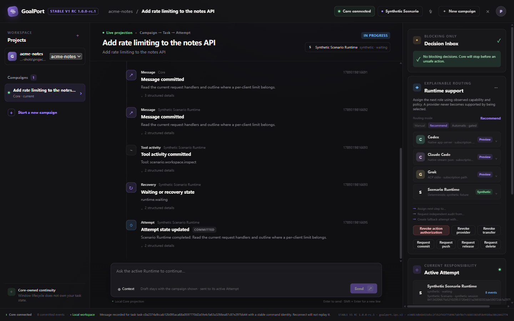
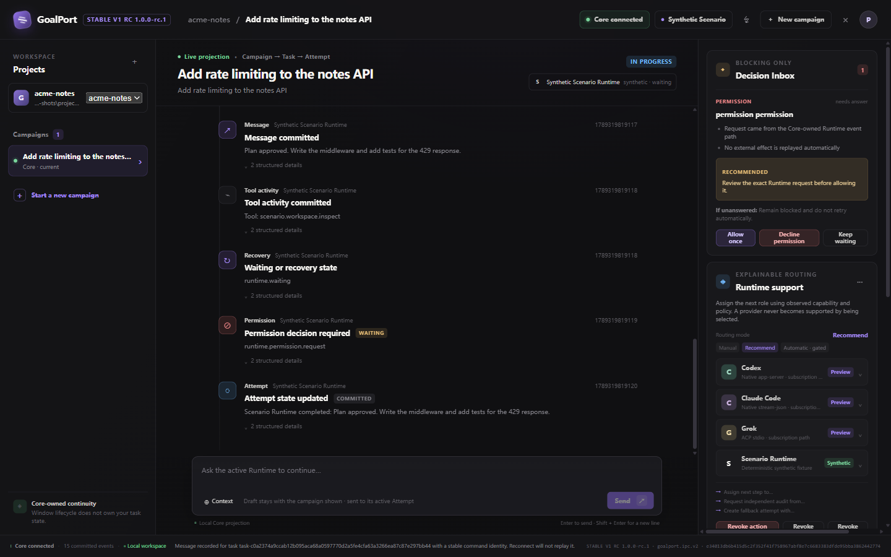
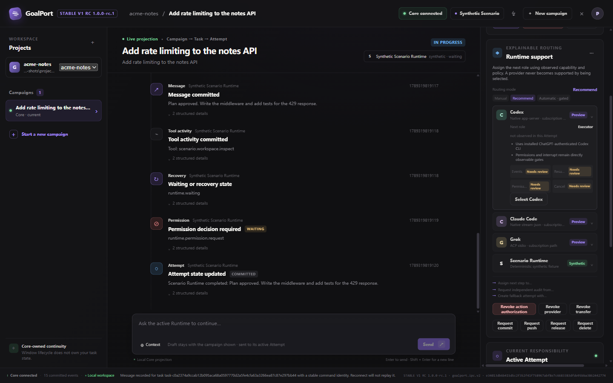

# GoalPort

**One Windows desktop for the coding agents you already use.**

GoalPort drives Codex, Claude Code and Grok through their own installed CLIs, so subscriptions, logins, skills, hooks, MCP servers and permission rules stay native. It adds durable Campaigns, Runtime switching, recovery and safety controls, all stored locally.

[](https://github.com/My-Denia/goalport/actions/workflows/ci.yml)




<sub>GoalPort 1.0.0-rc.1 on the built-in synthetic Scenario runtime (no real agent account involved).</sub>

## Why GoalPort

Agent CLIs work well inside one terminal session. Long tasks outgrow it: the terminal closes, a tool call's outcome is unclear, another agent should continue, or you return the next day and need to know what actually happened. GoalPort keeps that continuity in a local control plane, while the agents stay exactly as you configured them.

## GoalPort vs using the CLIs directly

| | CLI on its own | CLI through GoalPort |
| --- | --- | --- |
| Agent | Your installed CLI | The same installed CLI, started by GoalPort |
| Login, subscription, skills, hooks, MCP | Owned by the CLI | Unchanged, still owned by the CLI |
| Task state | Lives in the terminal session | Campaign → Task → Attempt, persisted in local SQLite |
| Closing the window | Usually ends the session | Work can continue in the background; reopen and reconnect |
| Switching agents | Copy context by hand | Assign the next step to another Runtime; the handoff is recorded |
| Permission prompts | Answered in the terminal | Answered in a Decision Inbox |
| Lost acknowledgement | Depends on the tool | Shown as unknown, never resent automatically |

## Features

- **Native Runtimes, one window.** Codex (app-server), Claude Code (stream-json) and Grok (ACP), plus a synthetic Scenario runtime for testing.
- **Durable work model.** Campaigns, Tasks, Attempts and their ordered events survive window closes and restarts.
- **Runtime selection and handoff.** Conflicting selections are refused, and a replacement Attempt records the one it replaced.
- **Core outlives the window.** Continue in the background, then reopen and reconnect.
- **Honest recovery.** After a restart, in-flight commands become unknown and prompts are never replayed.
- **Held responsibility after a Claude Code Stop.** Tools that may still be running keep conflicting work blocked.
- **Local-first.** No GoalPort account, server or telemetry.
- **Traceable build.** Locked dependencies, a hashed package manifest, and packaged GUI smoke tests in CI.

| Permission decisions | Runtime support |
| --- | --- |
|  |  |

## Quick start

There is no downloadable release yet. Build the RC from source on Windows x64 ([prerequisites](docs/building.md#prerequisites)):

```powershell
pnpm install --frozen-lockfile
pnpm electron:package --out artifacts/electron-rc/rc1
pnpm electron:verify --package artifacts/electron-rc/rc1/GoalPort-win32-x64
pnpm electron:start --package artifacts/electron-rc/rc1/GoalPort-win32-x64
```

1. Install and sign in to a Runtime CLI: Codex, Claude Code or Grok.
2. In GoalPort, choose a workspace folder and enter a Campaign goal.
3. Select a Runtime and send a message. Keep the window wider than 1020 px, or the right rail (Runtimes, Decision Inbox, Stop) is hidden.

Data lives in `%APPDATA%\GoalPort\rc`. Electron/Chromium browser shell state (caches, preferences, window geometry) is stored separately under `%APPDATA%\GoalPort\electron\<profile key>`, so the profile directory holds only durable GoalPort data. The package folder is unsigned and can be moved. To try GoalPort without an agent account, add `--test-profile <new absolute folder>`; it runs only the synthetic Scenario runtime. Contributors: see [development](docs/development.md).

## How it works

```text
GoalPort window (Electron + React)
        │  Named Pipe IPC
GoalPort Core (Rust) ── SQLite
        │  stdio
codex app-server · claude -p stream-json · grok agent stdio
```

The window only presents. Core owns all GoalPort state and supervises each Runtime through its native protocol. Read more in [Architecture](docs/architecture.md) and [Safety](docs/safety.md).

## Native, not reimplemented

- GoalPort starts the CLI you installed. It does not reimplement an agent or proxy a model API.
- It never writes Runtime configuration or passes permission-bypass flags.
- It strips `OPENAI_API_KEY`, `ANTHROPIC_API_KEY` and `XAI_API_KEY` from Runtime processes and never introduces API-key authentication.

Details: [runtime integration](docs/runtimes.md).

## Status

GoalPort **1.0.0-rc.1** is a **Stable V1 RC**: a release candidate, not Stable V1.

- Windows only, built from source, unsigned. No database migration between builds.
- Admission differs per Runtime (Codex partial, Claude Code partially admitted, Grok admitted), recorded for specific builds, not re-checked for builds from current source.
- After a Claude Code Stop, residual execution is unproven, and held workspaces cannot be released yet.

Full list: [limitations](docs/limitations.md).

## Documentation

| Topic | Pages |
| --- | --- |
| Build, run, local data | [Building](docs/building.md) · [Local data](docs/local-data.md) · [Limitations](docs/limitations.md) |
| How it works | [Architecture](docs/architecture.md) · [Runtime integration](docs/runtimes.md) · [Safety and recovery](docs/safety.md) · [Privacy](docs/privacy.md) |
| Contributing | [Development](docs/development.md) · [Testing and CI](docs/testing.md) |
| Records | [Reference records](docs/reference/README.md) · [History](docs/history/README.md) |

## Contributing

See [CONTRIBUTING.md](CONTRIBUTING.md).

## Security

Report vulnerabilities privately; see [SECURITY.md](SECURITY.md).

## License

Licensed under the [Apache License 2.0](LICENSE).
